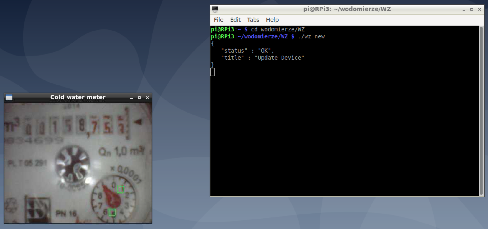
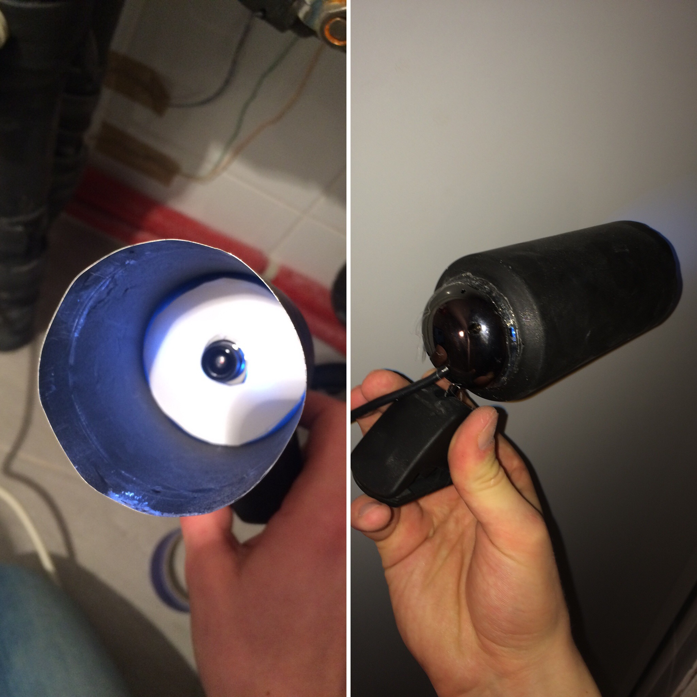

# USB Webcam Water Meter
## What it is and what it does?
This is a program written in C which uses `imgproc` image processing library to detect rotation of water meter's dial. It then sends data to Domoticz using `curl` library. I used this method to track water and brine flow rates a few years ago for my engineering thesis  with a good results. Now I am  using it to track water usage in Domoticz.

## How can I run it?
### Requirements 
* USB webcam (prefferably with LEDs)
* a computer to run the program - I use Raspberry Pi for this purpose
* couple of aluminium cans which act as an enclosure for the camera
* hot glue to mount the camera

### Hardware
Water meteres used at my location have a diameter that nearly ideally matches the diameter of 0.5L beer can. All you have to do is cut the can in half, make a hole in the bottom and glue the "enclosure" and camera together. Then slide it on the water meter and you are ready to go.

### Software
First of all you need to be able to compile C programs to run `USB Webcam Water Meter` so gcc is required. Run `sudo apt-get update && sudo apt-get upgrade` and then install gcc by typing `sudo apt-get install gcc`.

#### Customization and calibration
There are a few options to customize the program. There are a few definitions at the beggining of the `wz.c` file. You can change: 
* the resolution of the image taken from the camera
* define how many regions you want to watch
* define your Domoticz IP, PORT and Device IDX for the incremental counter

A few lines later in the same file you have to put the right coordinates, width and height of the regions you want the program to watch.
Region detection is accomplished by comparing RGB values against defined thresholds defined at line 64. You will have to change it to your own values as it depends on many factors such as lighting conditions and color of the water meter dial. 

If you want to use multiple cameras to track multiple meters you need to change device path in `camera.c` file at line 360. The default is `dev/video0` so change it to the value right for your devices.

After all is set up you can compile the program using `sudo make` command. It creates executable `wz` file which you can run from the program's directory by typing `./wz`.